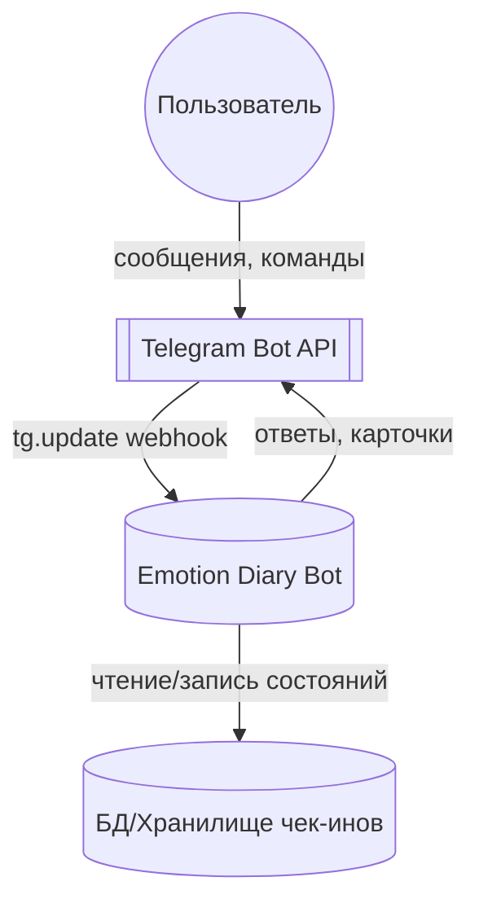
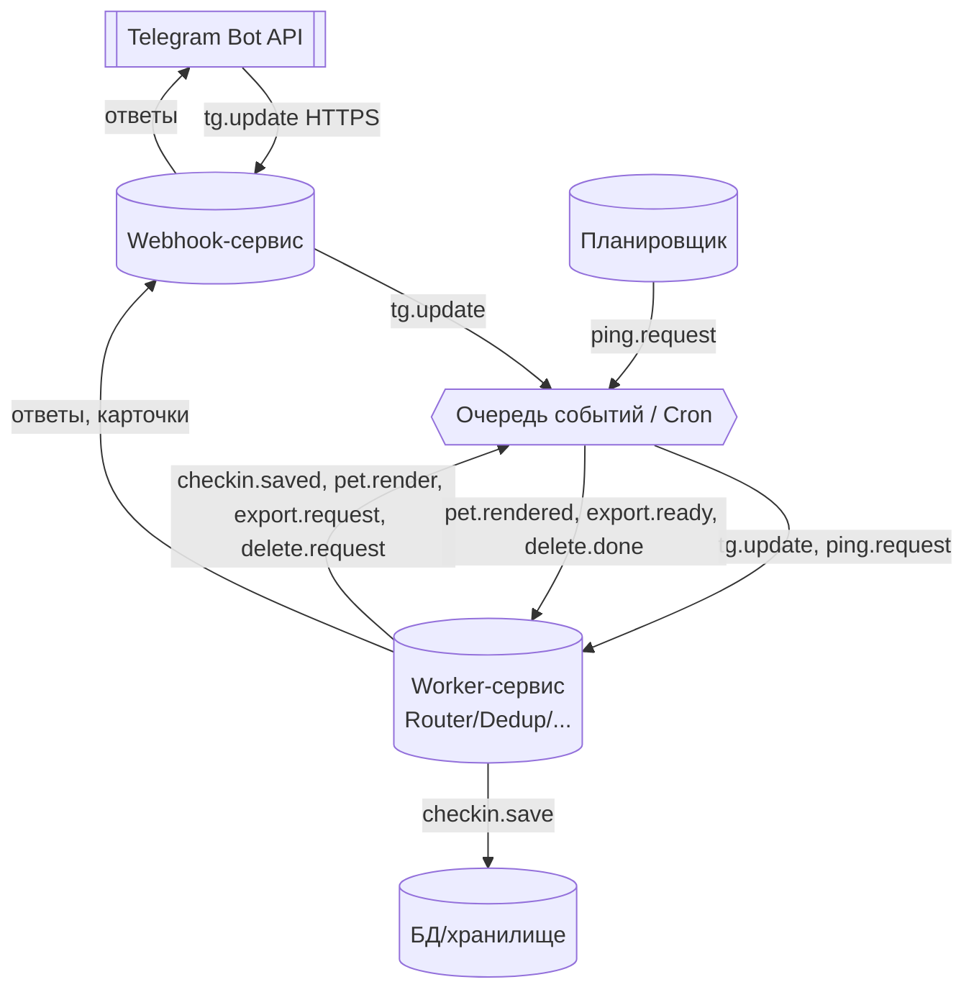
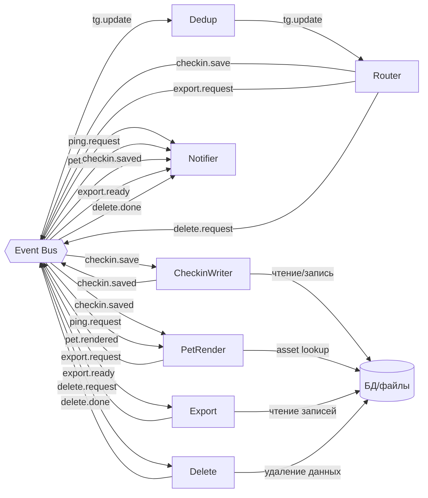
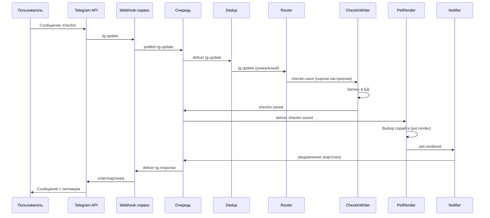
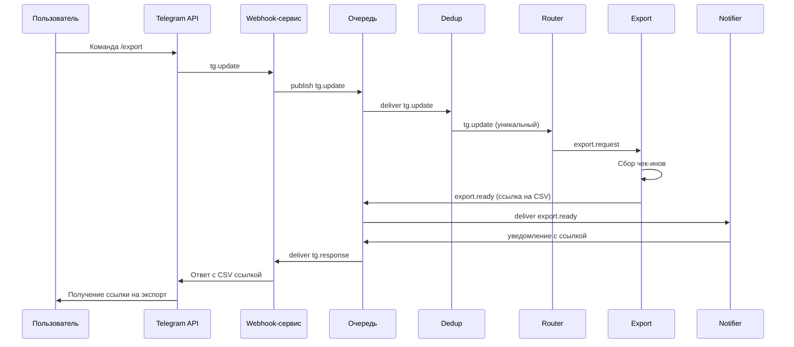
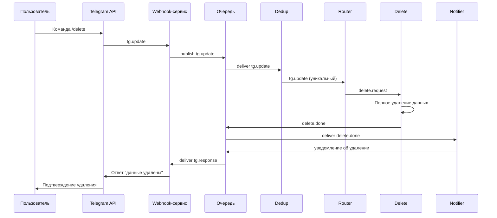
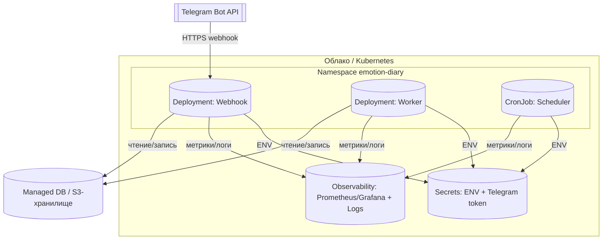

# Архитектура Emotion Diary

## 1. Цели и ограничения
- **Цель продукта** — помогать пользователю фиксировать настроение и получать эмоциональную поддержку в Telegram с минимальным трением.
- **Операционные принципы** — 12-Factor: конфигурация через `ENV`, статeless-процессы, независимые контейнеры для webhook, воркеров и планировщика; взаимодействие между ними построено на обмене событиями.
- **Ограничения среды** — использование Telegram Bot API (webhook с секретным заголовком), хранение пользовательских данных в управляемом хранилище с возможностью экспорта/удаления, минимальная задержка ответа пользователю (<2 c).
- **Качества** — устойчивость к повторной доставке (`Dedup`), наблюдаемость (метрики и логи по каждому контейнеру), защищённое хранение секретов (token, ключи экспорта).

## 2. Контекст системы (C4 L1)
Emotion Diary Bot взаимодействует с пользователем через Telegram Bot API: входящие сообщения поступают по webhook, ответы формируются ботом; доменные данные сохраняются в отдельном хранилище для дальнейших операций экспорта и удаления.

[Источник диаграммы: `docs/diagrams/c4-l1-context.mmd`]

## 3. Контейнеры (C4 L2)
- **Webhook-сервис** принимает webhook-и Telegram, валидирует подпись, публикует событие `tg.update` в очередь.
- **Worker-сервис** исполняет доменную логику (Router, Dedup, Notifier, Export/Delete, PetRender, CheckinWriter) и взаимодействует с базой/файловым хранилищем.
- **Планировщик** (CronJob) раз в сутки публикует `ping.request` для пользователей, чтобы инициировать вечерний чек-ин.
- **Очередь событий** гарантирует поставку событий и развязывает компоненты по времени; используется также как канал обратной связи для уведомлений.
- **Хранилище** сохраняет чек-ины, медиа и экспортированные файлы.

[Источник диаграммы: `docs/diagrams/c4-l2-container.mmd`]

## 4. Ключевые компоненты (C4 L3)
Компоненты внутри Worker-сервиса реализованы как независимые агенты (см. `AGENTS.md`), которые общаются через доменные события:
- **Router** — принимает `tg.update`, распознаёт команды `/start`, кнопки и свободный текст, транслируя их в доменные события: `checkin.save`, `export.request`, `delete.request`.
- **Dedup** — фильтрует повторно доставленные `tg.update` в окне 10 минут, чтобы избежать дублей операций.
- **CheckinWriter** — валидирует настроение и комментарий, записывает в БД/хранилище, эмитит `checkin.saved`.
- **PetRender** — по `ping.request` и `checkin.saved` выбирает визуальный спрайт питомца, возвращает `pet.rendered`.
- **Notifier** — по `pet.rendered`, `checkin.saved`, `export.ready`, `delete.done` формирует карточки и ответы пользователю в Telegram.
- **Export** — формирует CSV, выкладывает в временное хранилище, публикует `export.ready`.
- **Delete** — проводит полное удаление данных пользователя, сообщает `delete.done`.

[Источник диаграммы: `docs/diagrams/c4-l3-components.mmd`]

## 5. Runtime-сценарии
### 5.1 Вечерний чек-ин
1. Пользователь отправляет команду/кнопку чек-ина; `Dedup` гарантирует уникальность `tg.update`.
2. `Router` формирует `checkin.save`, `CheckinWriter` фиксирует запись и публикует `checkin.saved`.
3. `PetRender` выбирает спрайт (`pet.render` → `pet.rendered`), `Notifier` отправляет карточку пользователю.

[Источник диаграммы: `docs/diagrams/runtime-evening-checkin.mmd`]

### 5.2 Экспорт данных
1. Команда `/export` проходит через `Dedup` и `Router`, создавая `export.request`.
2. `Export` агрегирует чек-ины, сохраняет CSV и публикует `export.ready`.
3. `Notifier` отправляет пользователю ссылку на выгрузку.

[Источник диаграммы: `docs/diagrams/runtime-export.mmd`]

### 5.3 Удаление данных
1. `/delete` инициирует `delete.request` через `Router`.
2. `Delete` очищает данные пользователя и отправляет `delete.done`.
3. `Notifier` уведомляет пользователя о завершении операции.

[Источник диаграммы: `docs/diagrams/runtime-delete.mmd`]

## 6. Развертывание и эксплуатация
- **Хостинг** — контейнеры развёрнуты в Kubernetes (или эквивалентной облачной оркестрации) внутри namespace `emotion-diary`: Deployment для webhook, Deployment для worker, CronJob для планировщика.
- **Secrets** — токен Telegram, ключи экспорта, параметры БД предоставляются через Secret + `ENV`. Политика 12-Factor упрощает перенос конфигурации между средами.
- **Observability** — все контейнеры шлют метрики/логи в стек Prometheus/Grafana + централизованный логгер; алерты на рост ошибок webhook или задержек очереди.
- **Данные** — основная БД (PostgreSQL/Managed) для чек-инов и объектное хранилище (S3) для экспортов.

[Источник диаграммы: `docs/diagrams/deployment.mmd`]
